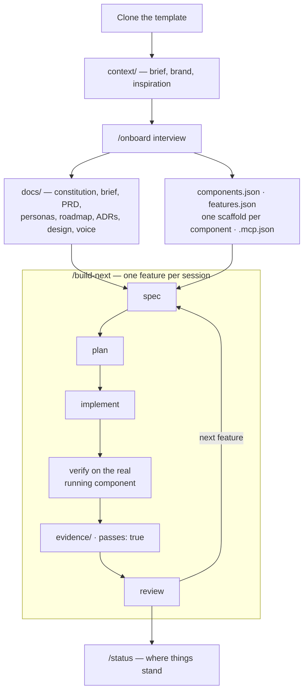

# claude-app-factory

**A GitHub template for products built end-to-end by AI agents.**

[](LICENSE)
[](https://claude.com/claude-code)

**Project status:** new. The onboarding flow has been reviewed end to end, but it has
not yet been battle-tested across many real projects — expect rough edges on unusual
stacks or component combinations. If something breaks or feels wrong,
[open an issue](https://github.com/Tekdey/claude-app-factory/issues); reports of what
the agent actually did are the fastest way to make this better.

Clone it, answer a guided interview, and Claude Code generates the entire project
foundation — constitution, product brief (Lean Canvas), PRD, personas, roadmap,
architecture decisions (ADRs), design system, tone of voice — then builds your product
feature by feature, session after session, verifying every behavior against the real
running code with captured proof.

A project is rarely one app. If yours ships a mobile app **and** an API **and** a
marketing site, the interview asks about all of them up front, and each becomes a
component with its own stack, scaffold and verification method — one repo, one PRD, one
design system, one roadmap.

Your role: product owner. You answer questions, approve the direction, and watch the
app take shape. The agent's role: the entire development team.

## How it works

Onboarding runs once and turns an empty template into a fully specified project.
Everything after that is the same loop, one feature per session, until the backlog is
empty.



## Quick start

1. **Create your repository** — click **"Use this template"** on GitHub (or clone this
   repo), then open the folder locally.
2. **Drop in your context** *(optional but recommended)* — put anything useful into
   `context/`: a brief, notes, your logo, brand guidelines, screenshots of apps you love
   or hate, competitor research… Any format (md, pdf, png, txt). Everything there is read
   **first** during onboarding and saves you from answering questions the material
   already covers. See `context/README.md`.
3. **Launch Claude Code** — run `claude` in the folder. Accept the workspace trust
   prompt, then approve the proposed MCP servers. (Optional but useful:
   `./init.sh doctor` checks your environment first.)
4. **Run `/onboard`** — answer the guided interview: product, **what the project ships**,
   audience, business model, design, tone, tech. Budget 30–45 minutes for a single
   component, 45–70 for three. Every question offers concrete options and a "you decide"
   escape hatch, so answering "your call" throughout is much faster.
5. **Let the agent generate** — it writes every foundation document into `docs/`, creates
   `components.json` (what ships) and `features.json` (the ledger of features to build),
   scaffolds each component in `apps/<id>/`, configures the MCP servers they need, and
   smoke-tests each one with proof saved to `evidence/`.
6. **Build, one feature at a time** — from then on, each session:
   - `/build-next` — builds the next feature (exactly one per session)
   - `/status` — where things stand: features passing, current phase, next action
   - `/verify` — re-checks features by driving the real app

## Commands

| Command | What it does |
|---------|--------------|
| `/onboard` | Guided interview + generation of every foundation doc, `components.json`, `features.json`, each component's scaffold and the MCP configuration. Run once after cloning (re-runnable to update or add a component). |
| `/design` | Proposes 2–3 distinct art directions with rendered previews, you pick one, then writes the design system into `docs/design/`. Re-runnable anytime. |
| `/build-next` | Builds the next feature from `features.json`: spec → plan → tasks → implementation → verification against the real running component(s) → captured proof. |
| `/verify` | Verifies one feature (`/verify F-012`), one component (`/verify api`), all of them (`/verify all`), or recently touched ones, by driving the real components. |
| `/status` | Read-only dashboard: X/Y features passing, progress against the roadmap, in-flight changes, suggested next action. |
| `/new-feature` | Adds a feature to the backlog (mini-interview, updates the PRD, roadmap and `features.json`). Implements nothing — `/build-next` does the building. |

## What gets generated, and where

```
docs/
  constitution.md        # the project's non-negotiables (versioned articles)
  product/               # brief.md (Lean Canvas), prd.md, personas.md, roadmap.md
  design/                # DESIGN.md, tokens, voice.md (tone of voice)
  tech/                  # tech-stack.md, architecture.md, structure.md, testing.md
  adr/                   # architecture decisions: 0001-….md, 0002-….md
specs/
  current/               # living spec of what is already built
  changes/<slug>/        # spec.md + plan.md + tasks.md for each feature
components.json          # what the project ships: stack, path, run script, verify method
features.json            # the feature ledger (passes: true/false + evidence path)
apps/<id>/               # source code, one folder per component
evidence/                # screenshots and transcripts proving each feature works
scripts/                 # format.sh + verify-quick.sh dispatchers, then <id>/ per component
PROGRESS.md              # session log — the agent's memory between sessions
```

None of this is written by hand: onboarding and the commands take care of it. The
skeletons used to generate these documents live in `templates/` (never edit them for a
specific project — they are the source).

## Components and platforms

Each component you declare gets its own stack, scaffold, scripts and — crucially — its own
way of proving that features work:

| Component kind | Default stack | How the agent verifies it | Evidence |
|---|---|---|---|
| **Mobile app** *(iOS default)* | SwiftUI, or Expo / React Native | XcodeBuildMCP / mobile-mcp — simulator, accessibility tree, UI interaction | screenshot |
| **Web app** | Next.js or Vite + React | Playwright MCP — headless browser | screenshot |
| **Marketing site** | Astro | Playwright MCP | screenshot |
| **API / backend** | Express + TypeScript | Real HTTP requests (vitest + supertest) | request/response transcript |
| **Admin dashboard** | same as the web app | Playwright MCP | screenshot |
| **CLI / library** | follows the component it serves | real commands / unit tests | output transcript |

Stacks are chosen **during onboarding**, one question per component. The agent then merges
the MCP servers your components need into `.mcp.json` (from `templates/mcp/`, plus a
backend block — Supabase, Convex — if you pick one). **Restart Claude Code afterwards**
and approve the new MCP servers, otherwise they won't be loaded.

Note that Expo can build in the cloud via EAS, so a mobile app is possible without a Mac;
native iOS requires macOS + Xcode.

The template ships preconfigured for native iOS (XcodeBuildMCP + context7).

## Philosophy

- **Spec first.** No feature is coded without a spec (EARS requirements + acceptance
  scenarios) and a plan checked against the project's constitution.
- **One feature at a time.** Each `/build-next` session delivers a single, fully verified
  feature before moving on.
- **Proof, not claims.** A feature is never "done" on the agent's word: `passes: true`
  requires a file in `evidence/` — a screenshot for UI, a request/response transcript for
  an API — showing the real behavior.
- **Docs are the agent's memory.** `PROGRESS.md`, `features.json`, `docs/` and `specs/`
  carry the whole project state, so any session can pick up exactly where the last one
  stopped.

## Requirements

- **macOS + Xcode** — only for native iOS (web works everywhere; Expo can build in the
  cloud via EAS, even without a Mac).
- **Node 18+** — required by the MCP servers.
- **jq** — used by the hooks and to read `features.json` (`brew install jq`).
- **git** and a recent version of **Claude Code**.

Two modes for `init.sh`:

- `./init.sh doctor` *(default)* — environment diagnostic: macOS, Xcode, booted
  simulator, Node ≥ 18, jq, git. Prints a ✓/✗ table with remediation hints. Purely
  informational (always exits 0).
- `./init.sh start [component-id]` — launches a component via `scripts/<id>/run.sh`
  (defaults to the primary one; only available after onboarding, which generates those
  scripts for your stacks).

## FAQ

**Can I re-run `/onboard` later?**
Yes. If it detects that `docs/constitution.md` already exists, it offers to update,
regenerate a specific section, or cancel. Nothing is overwritten without your approval.

**My project grew a new deliverable (an API, a site) — do I start over?**
No. Re-run `/onboard` and pick "Add a component": it asks about that one only, appends it
to `components.json`, scaffolds it, and extends the PRD, roadmap and feature ledger.
Everything already built stays untouched.

**Can I add context after onboarding?**
Yes. Drop new files into `context/` anytime: the agent reads them during an update run of
`/onboard` and whenever it needs to resolve an ambiguity mid-build.

**I don't like the design anymore — what now?**
Re-run `/design`. It proposes fresh art directions (or revises the current one), you pick
from rendered previews, and the design system is rewritten. Subsequent features apply the
new design.

**What language does the agent work in?**
It interacts in **your** language, detected from your messages. The language of the
generated documents is chosen during onboarding (default: the language you answered in).

**Can the agent read my secrets (`.env`)?**
No. Reading `.env` is denied by the permissions in `.claude/settings.json`, and a hook
blocks attempts to work around it. Copy `.env.example` to `.env` and fill in your keys
yourself.

## Credits

This template assembles and adapts patterns from remarkable open source projects:

- [github/spec-kit](https://github.com/github/spec-kit) — constitution, doc templates, the spec → plan → tasks chain
- [BMAD-METHOD](https://github.com/bmad-code-org/BMAD-METHOD) — themed interview (product, audience, business, design)
- [Agent OS](https://github.com/buildermethods/agent-os) — standards / product / specs layering, plan-product flow
- [OpenSpec](https://github.com/Fission-AI/OpenSpec) — change-based spec lifecycle (`specs/changes/` → `specs/current/`)
- [ai-dev-tasks](https://github.com/snarktank/ai-dev-tasks) — clarifying questions before the PRD, task decomposition
- [Anthropic engineering](https://www.anthropic.com/engineering) — long-running agent harness (feature ledger, session ritual) and the frontend-design skill
- [awesome-design-md](https://github.com/VoltAgent/awesome-design-md) — the 9-section DESIGN.md schema
- [Ash Maurya's Lean Canvas](https://leanstack.com/lean-canvas) — product brief structure

Licenses and adaptation details: [THIRD_PARTY_NOTICES.md](THIRD_PARTY_NOTICES.md).

## Contributing

Contributions change the **machinery** — skills, agents, hooks, templates, scaffold
recipes — never product code. Start with [CONTRIBUTING.md](CONTRIBUTING.md): it covers
the repo layout, how to test a change (clone to a temp dir, run `/onboard`, inspect what
came out), and the conventions that break things silently if ignored. Participation is
governed by the [Code of Conduct](CODE_OF_CONDUCT.md); vulnerabilities go through
[SECURITY.md](SECURITY.md), not a public issue.

## License

MIT — see [LICENSE](LICENSE). Use it, fork it, adapt it freely.
