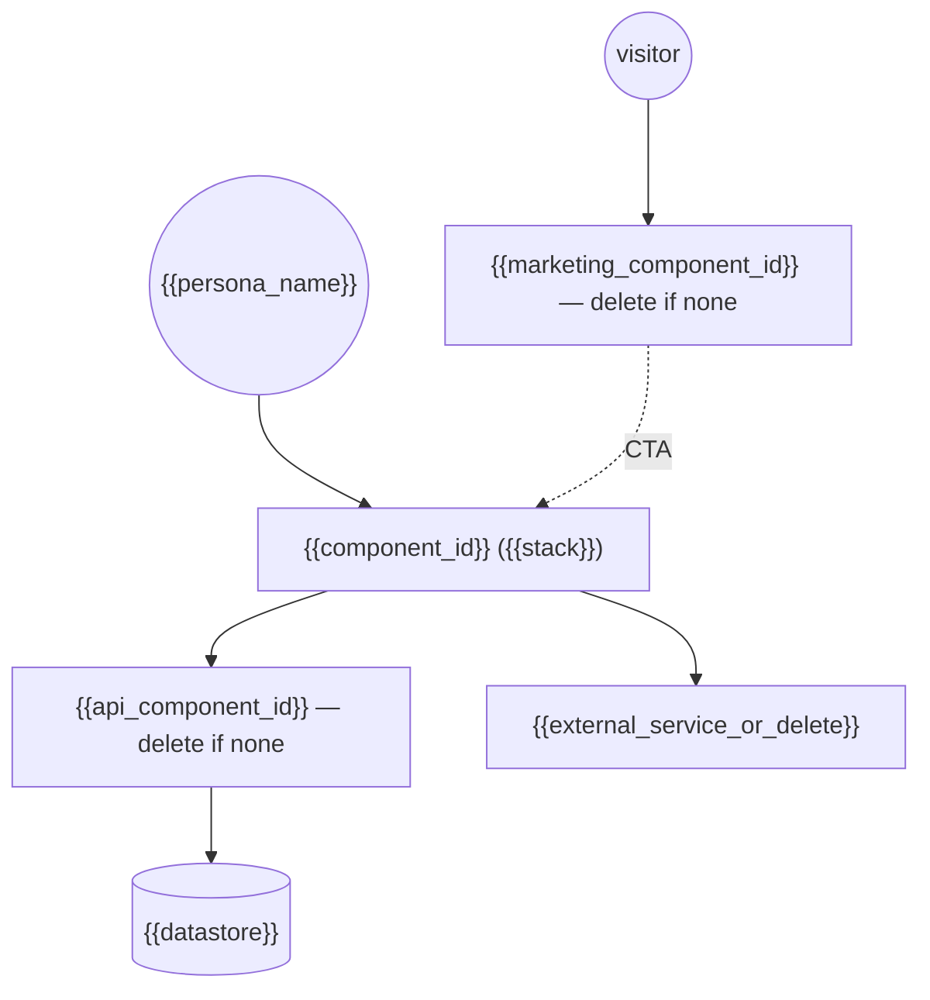

<!-- TEMPLATE: instructions for the agent filling it.
Destination: docs/tech/architecture.md. Filled by /onboard after tech-stack.md.
Describe the system as it is DESIGNED TO BE at v1 — update it when reality
diverges (living doc). Keep it one screen per section; an agent reads this
before any cross-module change. Replace every {{placeholder}}; delete all
comments from the filled instance. -->

# {{app_name}} — Architecture

## System Context

<!-- Mermaid diagram showing EVERY component from components.json, the calls
between them (matching depends_on), and every external system (managed backend,
third-party APIs, OS services, notifications). A single-component local app may
be just App + local storage — that is fine and worth stating. -->

{{one_paragraph_reading_of_the_diagram}}

## Component Contracts

<!-- Delete this section for a single-component project. One row per edge in the
diagram: who calls whom, how, and what breaks if the contract changes. This is
the table that prevents silent drift between an API and its consumers. -->

| From → To | Interface | Contract lives in | On change |
|---|---|---|---|
| `{{consumer_id}}` → `{{provider_id}}` | {{http_rest_or_package_import}} | {{path_to_schema_or_types}} | {{who_must_be_updated_and_reverified}} |

- **Shared identity**: {{how_a_user_session_flows_between_components}}
- **Environments**: {{which_base_urls_each_component_uses_locally_and_in_prod}}
- **Contract breakage rule**: changing a contract means re-verifying **both**
  sides — the feature entry lists both components for exactly this reason.

## Main Modules

<!-- 3-7 modules max per component at this altitude. One row each: what it owns,
what it must never do. Module names must match real folders in
docs/tech/structure.md. Repeat the table per component when there are several. -->

### {{component_id}}

| Module | Owns | Never does |
|---|---|---|
| {{module_1}} | {{responsibility}} | {{boundary}} |
| {{module_2}} | {{responsibility}} | {{boundary}} |
| {{module_3}} | {{responsibility}} | {{boundary}} |

## Data Flow

<!-- How data moves for the core job: user action → state change → persistence →
UI update. One short numbered sequence for the most important flow; add a second
only if the app has two genuinely different flows (e.g. local edit vs sync). -->
1. {{step_1}}
2. {{step_2}}
3. {{step_3}}

## State Management

{{state_management_approach}}
<!-- The single chosen pattern (e.g. "@Observable models owned by the scene,
passed down via environment" or "server state via query cache, UI state local").
Name what is the source of truth and what is derived. Agents must not introduce
a second pattern without an ADR. -->

## Sync & Offline Strategy

{{sync_offline_strategy}}
<!-- One of: local-only (say so explicitly), offline-first with background sync
(state the conflict rule, e.g. last-writer-wins per field), or online-required
(state what the app shows offline). This is a frequent source of silent scope
creep — be precise. -->

## Error Handling Strategy

<!-- The uniform rules, not per-feature detail:
- where errors are caught (boundary layers),
- what the user sees (must follow docs/design/voice.md error register),
- what gets logged and where,
- retry policy for transient failures. -->
{{error_handling_rules}}

## Security Notes

<!-- Only what applies: where sensitive data lives (Keychain/secure storage),
what is never logged, transport rules, auth token lifecycle, compliance notes
from PRD section 7. Secrets live in .env and are NEVER read by agents. -->
{{security_notes}}
